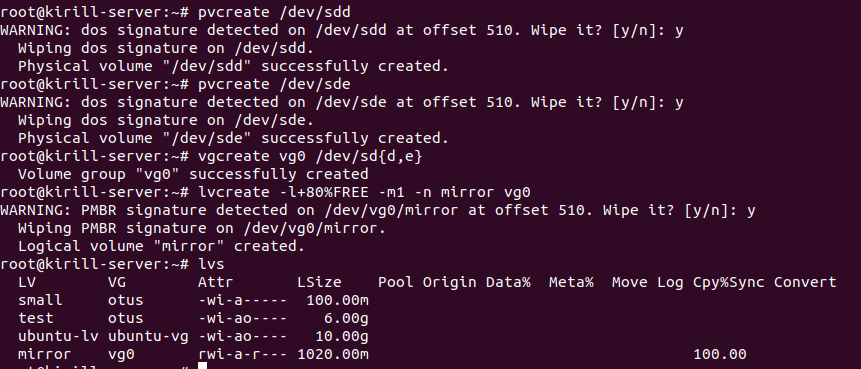

ДЗ. Работа с LVM

Будем работать с этими блочными устройствами.

Создали VG, с размером 5гб, как в PV. Также видим, что VG содержит PV /dev/sdb.

Отобразим информацию по LV, который создали на базе VG. Видим, что он размером около 4гб, т.е. 80% от VG.
Понимаем, что в VG еще осталось 20% (примерно 1гб)

Используя команды vgs and lvs видим такую же инфорацию как и выше, только в сжатом виде.

Создаем еще один LV, но фикс. размером 100мб.

Создали FS на LV test. Затем смонтировали на каталог /data. Как видим, /data - каталог монтирования на FS ext4

Расширение LVM

Допустим нужно добавить пространство к /dev/otus/test. Создаем новый PV, затем его подключаем к VG.

Заполнили LV полностью.

Теперь увеличиваем LV за счет недавно дополненного PV. Расширили до 8.71Гб.

Видно, что файловая система не изменилась. Производим resize FS. Видим, что FS расширилась.

Допустим Вы забыли оставить место на снапшоты. Можно уменьшить существующий LV с помощью команды lvreduce, но перед этим необходимо отмонтировать файловую систему, проверить её на ошибки и уменьшить ее размер:
Изменяем размер до 6Гб.
Отмонтировали /data. Проверили на ошибки блочное устройство LV, затем заресайзили FS до 6Гб. И затем заресайзили сам LV до 6гб.
После чего снова смонтировали в /data и проверили, что LV otus стал 6Гб.

Работа со снапшотами

Создали снепшот.

Примонтировали снепшот. Убедились, что файл присутствует от орин.LV и отмонтировали.

Отмонтировали также оригин LV, но я уже ранее запустил процесс слияния. Как почитал в интернетах, вроде надо ждать
какое-то время.

Еще почитал, надо было просто ребутнутся. Ребутнулся, затем примонтировал оригин. LV и увидел снова мой удаленный файл.

Работа с LVM-RAID

Создали PV, VG, LV mirror. Видим, что mirrir LV чуть более 1Гб. Это данные, которые зеркалируются.
То есть нам потребовалось условно 2Гб для создания зеркала с хранением 1Гб данных. Похоже он вычислил 2400мб, разделил
на 2 и получил по 1200мб для каждого PV, но у меня один PV 2гб, другой 1гб. Поэтому LVM взял то макс количество мб из которого
сможет сделать зеркало, а это определяется размером минимального PV.

Домашнее задание

Уменьшить том под / до 8G

Создал новый PV, затем VG, затем LV и создал файловую систему ext4.

Сделал монтирование в /mnt и туда скопировал все из /

Переключились на систему /mnt. Делаем lsblk и видим такую картину.

Теперь нам нужно изменить размер старой VG и вернуть на него рут. Для этого удаляем старый LV размером в 10G и создаём новый на 8G:
У меня старый VG это ubuntu--vg-ubuntu--lv размером 10Гб. Буду изменять его размер с 10Гб до 8гб.
Удалил старый LV, создал новый.

Проделываю те же операции, что и выше - т.е. копирую обратно файлы и монтирую каталоги. Пока не перезагружаюсь.

Пока не перезагружаемся и не выходим из под chroot - мы можем заодно перенести /var.
Выделить том под /var в зеркало

Создали LV зеркало lv_var на 950Мб.

Создаем на нем ФС и перемещаем туда /var.

В общем закинули все из var в зеркало, а затем его примонтировали в /var. Т.е. на текущем этапе имеем в зеркале
данные из каталога var.

Правим fstab и перезагружаемся.

После перезагрузки удаляем. Также видим, что ubuntu--vg-ubuntu--lv уже 8гб.

Выделить том под /home

Делаем то же самое, что и для var. Создали LV, примонтировали, скинули туда файлы из оригинального home и отмонтировали.
Затем уже LV примонтировали к home.

Правим fstab. Чтобы файловая система в примонтированной к home была известна корневой/текущей системе при загрузке.

Работа со снапшотами

Создали файлы в home и создали LV снапшот. Затем удалили часть файлов.

Видим, что снапшот 100Мб и заполнен он на 0.01%.

Восстанавливаем из снапшота. Отмонтировали home, сделали merge снапшота на оригинальный LV и получили все удаленные файлы.
