ДЗ. NFS

Установили nfs-server. У меня сервер имеет IP 192.168.0.109, а клиент 192.168.0.108
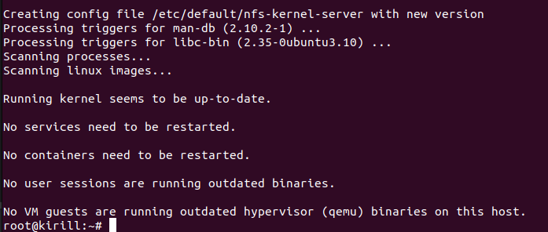

Создали директорию и прописали права доступа.
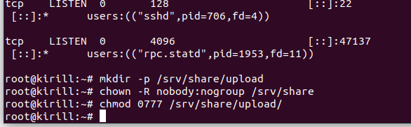

Экспортировали директорию.
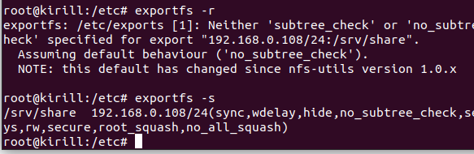

Добавили в fstab инфорацию о сетевой директории.
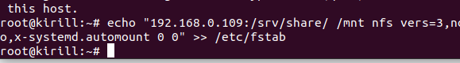
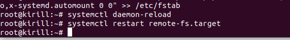

Проверка монтрования.
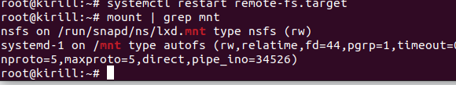

На сервере создаем файл. Затем на клиенте проверяем и убеждаемся, что файл существует и виден.
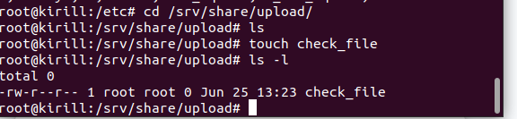
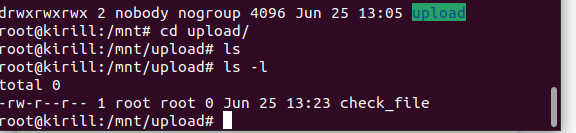

Перезагрузили клиент и сервер. Доступ к директории сохранился.
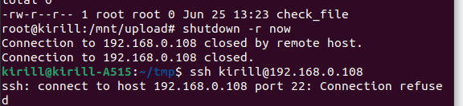
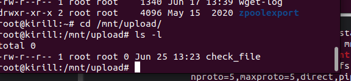
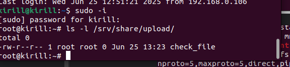

Перезагрузили еще раз клиента, проверили монтирование, создали на сервере еще один файл final_check и проверили, что
он показывается на клиенте.
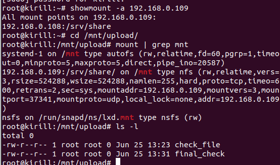

