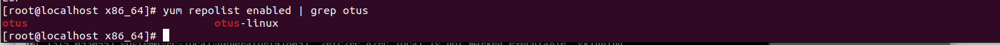

ДЗ. Управление пакетами. Дистрибьюция софта

Установили необходимые программы.

Установили nginx.

Поставили все зависимости для сборки nginx.

Скачали исходный код для модуля ngx_brotli для сборки.

Собрали модуль ngx_brotli.

Отредактировали файл спецификации nginx. Добавили путь до модуля.

Выполняем сборку RPM-пакета.

Пакеты собрались.

Скопировали в общий каталог.

Запустили nginx, убедились, что он активен.

Создать свой репозиторий и разместить там ранее собранный RPM

Создали repo и скопировали туда пакеты.

Отредактировали конфигурацию nginx.

По Curl видны пакеты в директории repo.

Добавляем новый наш репозиторий в общий перечень репозиторий в системе.

Репозиторий виден и работает.

Добавили пакет в репозиторий, обновили репозиторий и обновили кэш в yum.

Установили репозиторий percona-release.

