ДЗ. Работа с mdadm

• Добавить в виртуальную машину несколько дисков

Добавили в виртуальную машину несколько дисков:
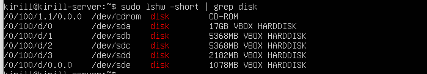

На всякий случай удаляем супер блоки на дисках, в которых могут быть метаданные предыдущих RAID-массивов. Иначе, мы
не сможем использовать диск для создания RAID.
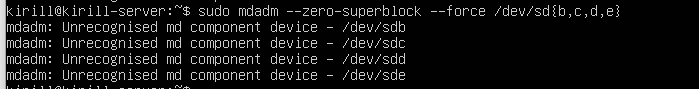

• Собрать RAID-0/1/5/10 на выбор

Создаем RAID-1 из 4х дисков:
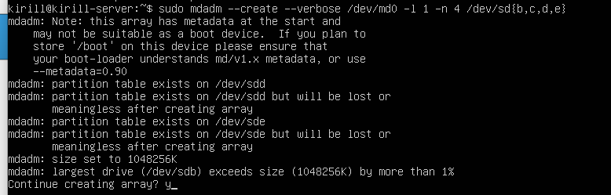

Убеждаемся, что с RAIDом все ок и он содержит нами указанные диски:
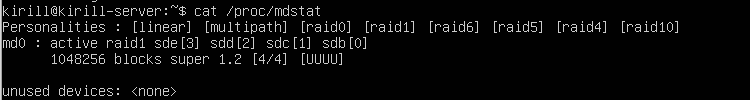

• Сломать и починить RAID

Сломали RAID, путем зафейливования диска /dev/sde. Теперь видим флаг F у этого диска в RAID.
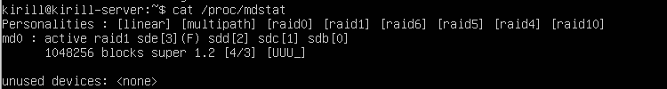

Удалили этот диск из массива дисков в RAID.
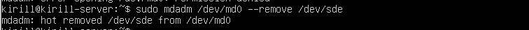

Имеем следующую картину по RAIDу. Видим, что работающих 3 блочных устройства из 4х. Добавляем отсутствующий..
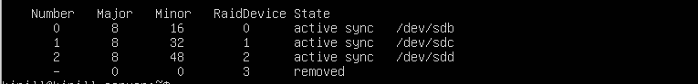

Добавили диск обратно. Видим, что он появился в RAID.
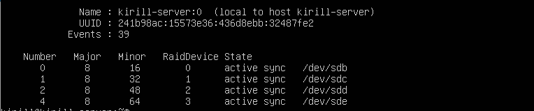

• Создать GPT таблицу, пять разделов и смонтировать их в системе.

Создали разделы на RAID.
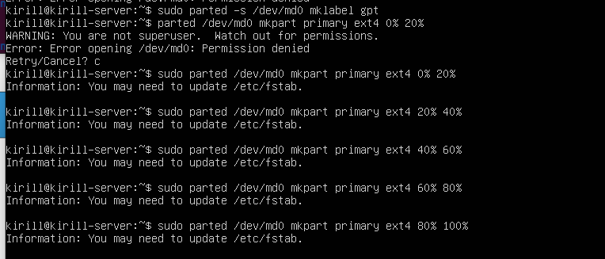
Видим, что RAID-1 соответствует своей структуре на уровне разделов блочных устройств.
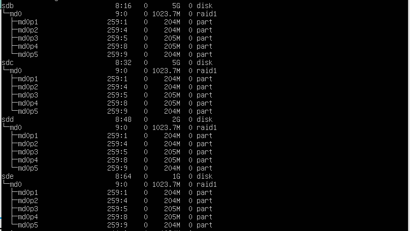

С помощью mkfs и mount, создали файловые системы на разделах и смонтировали их в нужные каталоги.


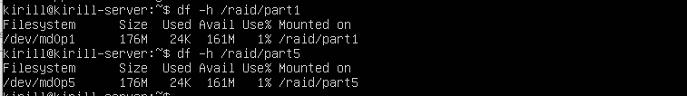

ДЗ. Обновление ядра системы

Что потребуется сделать?

    Запустить ВМ c Ubuntu.
    Обновить ядро ОС на новейшую стабильную версию из mainline-репозитория.
    Оформить отчет в README-файле в GitHub-репозитории.

```
kirill@kirill-server:~$ uname -r
5.15.0-139-generic
```
Получили версию текущего ядра: 5.15.0-139-generic

```
kirill@kirill-server:~/kernel$ wget https://kernel.ubuntu.com/mainline/v5.15.182/amd64/linux-headers-5.15.182-0515182-generic_5.15.182-0515182.202505091028_amd64.deb
--2025-05-13 13:18:39--  https://kernel.ubuntu.com/mainline/v5.15.182/amd64/linux-headers-5.15.182-0515182-generic_5.15.182-0515182.202505091028_amd64.deb
Resolving kernel.ubuntu.com (kernel.ubuntu.com)... 185.125.189.74, 185.125.189.76, 185.125.189.75
Connecting to kernel.ubuntu.com (kernel.ubuntu.com)|185.125.189.74|:443... connected.
HTTP request sent, awaiting response... 200 OK
Length: 2771590 (2.6M) [application/x-debian-package]
Saving to: ‘linux-headers-5.15.182-0515182-generic_5.15.182-0515182.202505091028_amd64.deb’

linux-headers-5.15. 100%[===================>]   2.64M  3.62MB/s    in 0.7s    

2025-05-13 13:18:41 (3.62 MB/s) - ‘linux-headers-5.15.182-0515182-generic_5.15.182-0515182.202505091028_amd64.deb’ saved [2771590/2771590]

kirill@kirill-server:~/kernel$ wget https://kernel.ubuntu.com/mainline/v5.15.182/amd64/linux-headers-5.15.182-0515182_5.15.182-0515182.202505091028_all.deb
--2025-05-13 13:18:49--  https://kernel.ubuntu.com/mainline/v5.15.182/amd64/linux-headers-5.15.182-0515182_5.15.182-0515182.202505091028_all.deb
Resolving kernel.ubuntu.com (kernel.ubuntu.com)... 185.125.189.75, 185.125.189.74, 185.125.189.76
Connecting to kernel.ubuntu.com (kernel.ubuntu.com)|185.125.189.75|:443... connected.
HTTP request sent, awaiting response... 200 OK
Length: 12240962 (12M) [application/x-debian-package]
Saving to: ‘linux-headers-5.15.182-0515182_5.15.182-0515182.202505091028_all.deb’

linux-headers-5.15. 100%[===================>]  11.67M  7.41MB/s    in 1.6s    

2025-05-13 13:18:51 (7.41 MB/s) - ‘linux-headers-5.15.182-0515182_5.15.182-0515182.202505091028_all.deb’ saved [12240962/12240962]

kirill@kirill-server:~/kernel$ wget https://kernel.ubuntu.com/mainline/v5.15.182/amd64/linux-image-unsigned-5.15.182-0515182-generic_5.15.182-0515182.202505091028_amd64.deb
--2025-05-13 13:18:57--  https://kernel.ubuntu.com/mainline/v5.15.182/amd64/linux-image-unsigned-5.15.182-0515182-generic_5.15.182-0515182.202505091028_amd64.deb
Resolving kernel.ubuntu.com (kernel.ubuntu.com)... 185.125.189.74, 185.125.189.76, 185.125.189.75
Connecting to kernel.ubuntu.com (kernel.ubuntu.com)|185.125.189.74|:443... connected.
HTTP request sent, awaiting response... 200 OK
Length: 11704512 (11M) [application/x-debian-package]
Saving to: ‘linux-image-unsigned-5.15.182-0515182-generic_5.15.182-0515182.202505091028_amd64.deb’

linux-image-unsigne 100%[===================>]  11.16M  7.45MB/s    in 1.5s    

2025-05-13 13:18:58 (7.45 MB/s) - ‘linux-image-unsigned-5.15.182-0515182-generic_5.15.182-0515182.202505091028_amd64.deb’ saved [11704512/11704512]

kirill@kirill-server:~/kernel$ wget https://kernel.ubuntu.com/mainline/v5.15.182/amd64/linux-image-unsigned-5.15.182-0515182-generic_5.15.182-0515182.202505091028_amd64.deb^C
kirill@kirill-server:~/kernel$ wget https://kernel.ubuntu.com/mainline/v5.15.182/amd64/linux-modules-5.15.182-0515182-generic_5.15.182-0515182.202505091028_amd64.deb
--2025-05-13 13:19:20--  https://kernel.ubuntu.com/mainline/v5.15.182/amd64/linux-modules-5.15.182-0515182-generic_5.15.182-0515182.202505091028_amd64.deb
Resolving kernel.ubuntu.com (kernel.ubuntu.com)... 185.125.189.75, 185.125.189.74, 185.125.189.76
Connecting to kernel.ubuntu.com (kernel.ubuntu.com)|185.125.189.75|:443... connected.
HTTP request sent, awaiting response... 200 OK
Length: 83850618 (80M) [application/x-debian-package]
Saving to: ‘linux-modules-5.15.182-0515182-generic_5.15.182-0515182.202505091028_amd64.deb’

linux-modules-5.15. 100%[===================>]  79.97M  11.2MB/s    in 7.6s    

2025-05-13 13:19:28 (10.5 MB/s) - ‘linux-modules-5.15.182-0515182-generic_5.15.182-0515182.202505091028_amd64.deb’ saved [83850618/83850618]

```
Скачаны пакеты ядра.
```
kirill@kirill-server:~/kernel$ sudo dpkg -i *.deb
```
Установили все пакеты в данной директории.
```
kirill@kirill-server:~/kernel$ sudo update-grub
Sourcing file `/etc/default/grub'
Sourcing file `/etc/default/grub.d/init-select.cfg'
Generating grub configuration file ...
Found linux image: /boot/vmlinuz-5.15.182-0515182-generic
Found initrd image: /boot/initrd.img-5.15.182-0515182-generic
Found linux image: /boot/vmlinuz-5.15.0-139-generic
Found initrd image: /boot/initrd.img-5.15.0-139-generic
Warning: os-prober will not be executed to detect other bootable partitions.
Systems on them will not be added to the GRUB boot configuration.
Check GRUB_DISABLE_OS_PROBER documentation entry.
done
kirill@kirill-server:~/kernel$ sudo grub-set-default 0
```
Установили загрузку нового ядра по умолчанию.
```
kirill@kirill-server:~$ uname -r
5.15.182-0515182-generic
```
Перезагрузили машину с помощью sudo reboot и видим новую версию ядра 5.15.182-0515182-generic


