ДЗ. SYSTEMD

Написать service, который будет раз в 30 секунд мониторить лог на предмет наличия ключевого слова

Создал файлы. /etc/default/watchlog - конфиг сервиса. и сами логи.
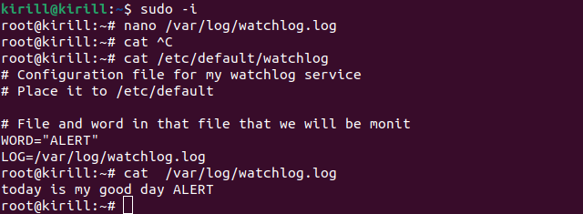

Создал скрипт.
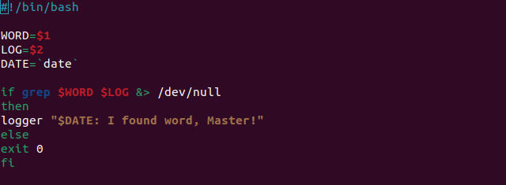

Создал юнит для сервиса.
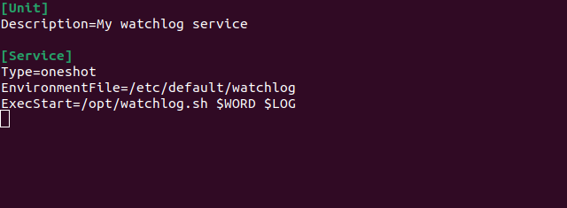

Создал юнит для таймера.
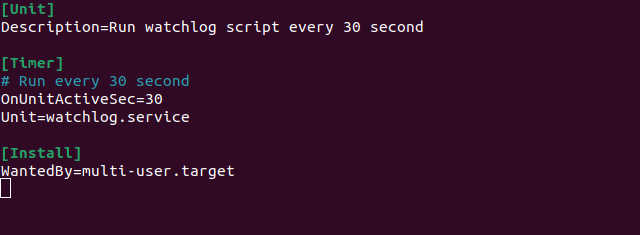

Почему-то таймер не отрабатывает, но вручную запуск сервис вотчера работает.
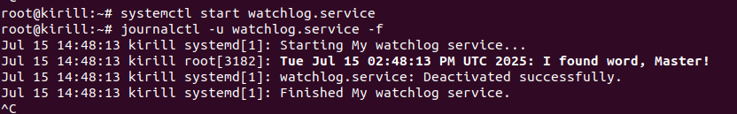

Нет, начал отрабатывать. Показывает время следующего запуска. 
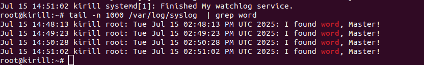
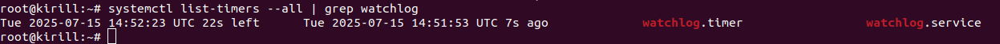

Установить spawn-fcgi и создать unit-файл (spawn-fcgi.sevice) с помощью переделки init-скрипта

Установил spawn-fcgi.
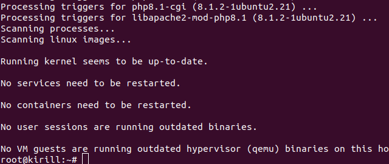

Создал файл fcgi.conf
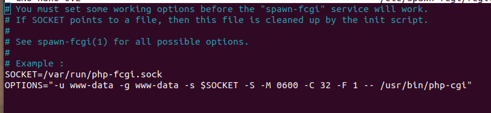

Написал fcgi.service
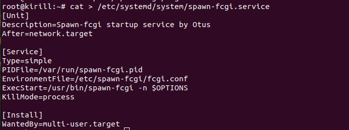

Создал php-fcgi.sock и выполнил spawn-fcgi статус - работает.
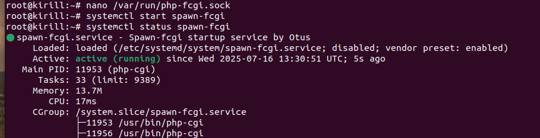

Доработать unit-файл Nginx (nginx.service) для запуска нескольких инстансов сервера с разными конфигурационными файлами одновременно

Создал файл unit-а и установил nginx.
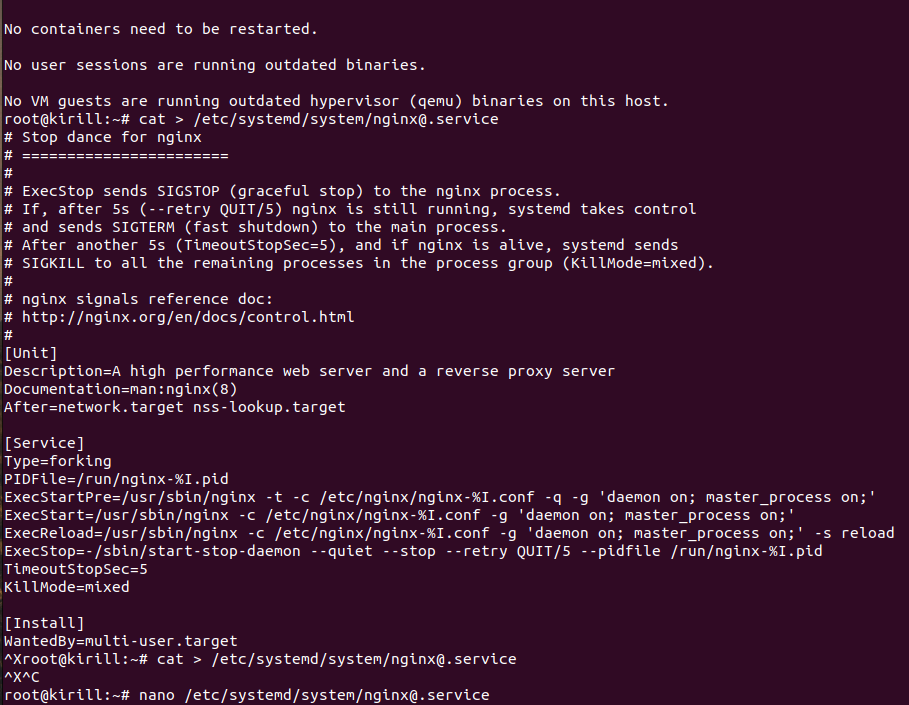

Создал два файла и добавил конфигурацию в них.

Запустил nginx-ы с разными конфигами на разных портах. Видим, что слушаются указанные в конфиге порты.
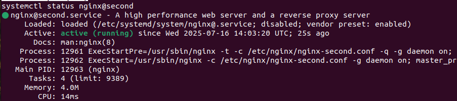
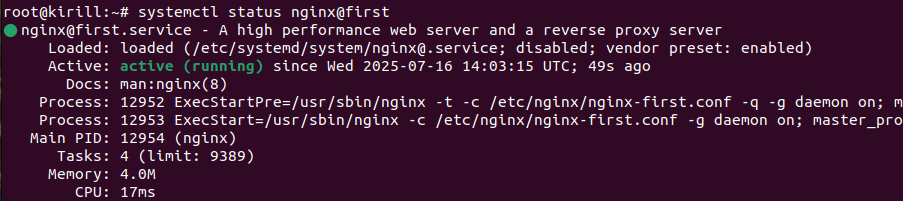
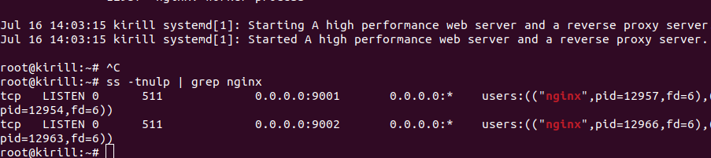

Видим две группы процессов. Все в порядке.
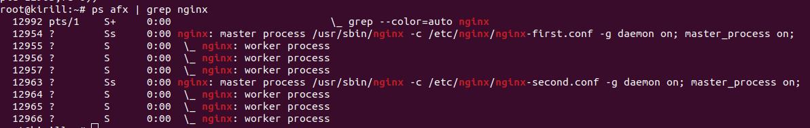

p.s. была проблема с запуском экземпляров nginx, как оказалось, надо было закомментить "include /etc/nginx/sites-enabled/*;"
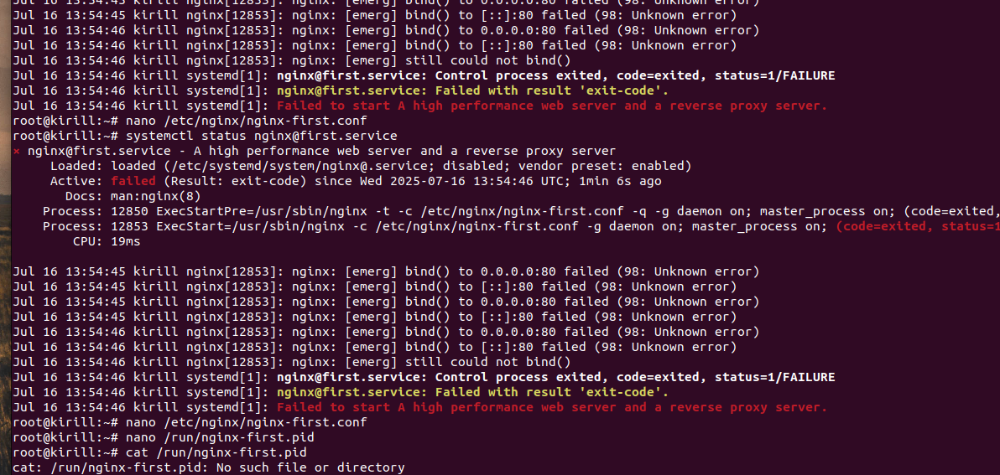