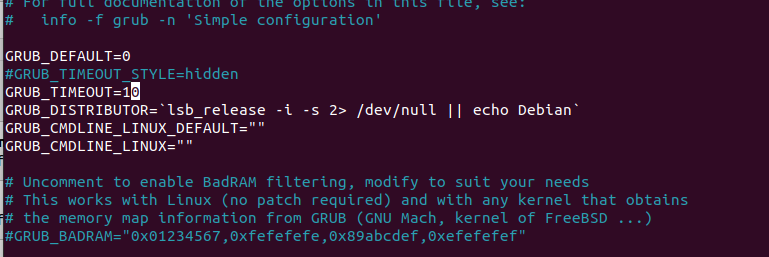
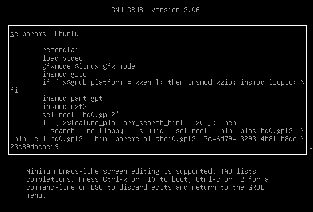
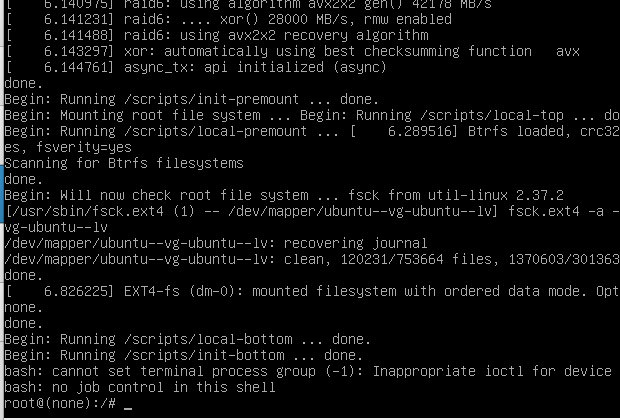
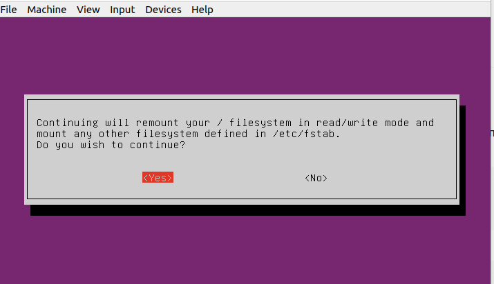
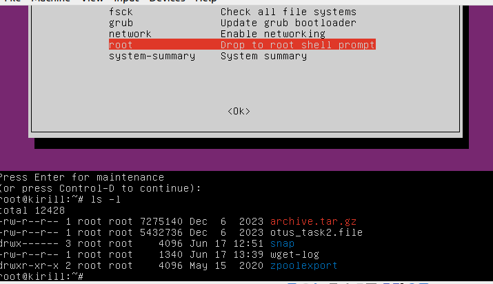
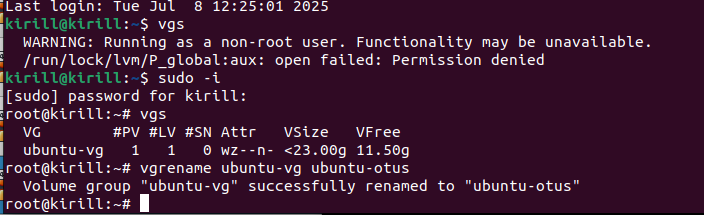
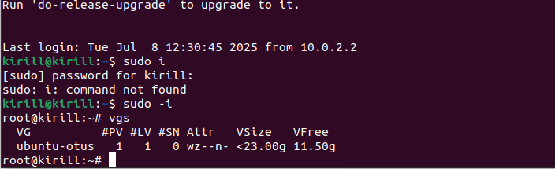

ДЗ. Загрузка системы

Вариант 1.

Отредактировал конфиг grub.

Зашел в редактор, чтобы изменить параметры загрузки.

Отредактировал, система загрузилась по рутом.

Вариант 2.

В загрузочном меню (режим восстановления) включаем сеть.

Зашли под рутом, можем делать что хотим.

Вариант 3. LVM

Переименовали VG.

Перезагрузился, вижу, что VGS группа переименована и успешно загрузился.

