ДЗ. ZFS

1. Определить алгоритм с наилучшим сжатием:

Добавили блочные устройства.
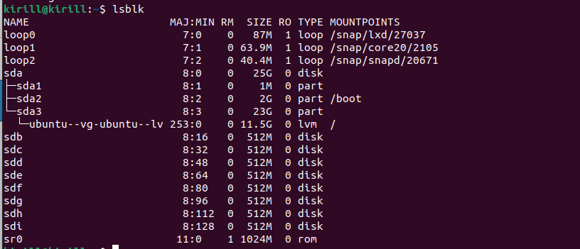

Создали 4 пула.
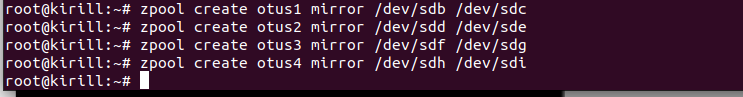
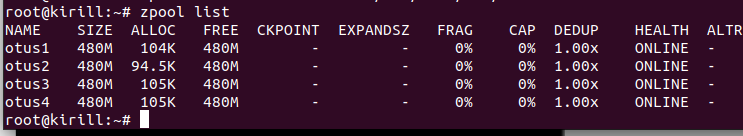

Установили для каждого пула свой метод сжатия.
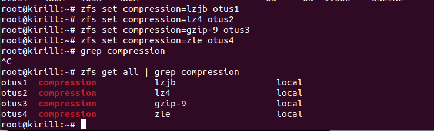

Скачали файлы в каждый пул. При записи файл сжался.
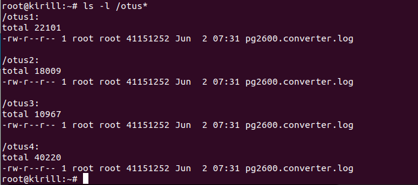

Видно, что лучшее сжатие достигнуто на otus3, т.е. метод gzip-9 лучше всего сжал.
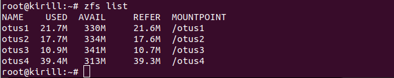

2. Определить настройки пула.

Скачали архив и разорхивировали его.
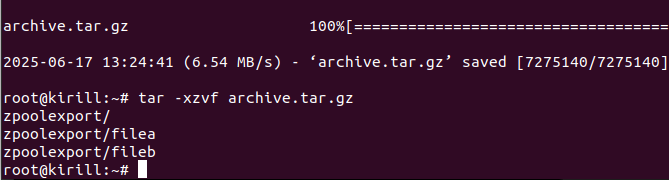

Обнаружили в архиве пул otus, RAID-0.
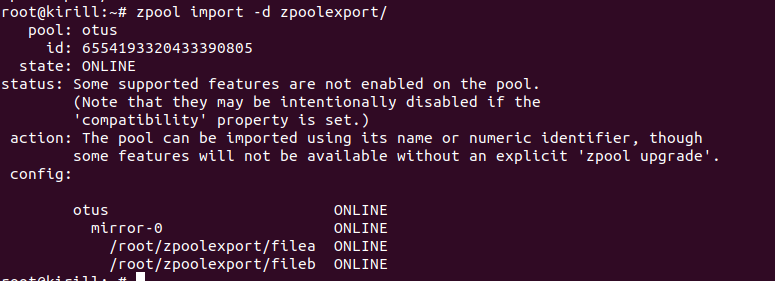

Импортировали в систему и видим, что пул добавился.
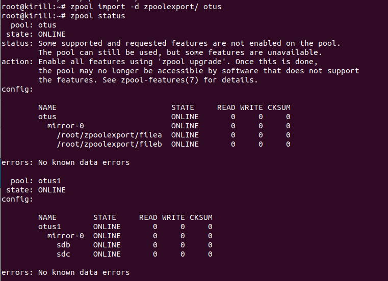

Смотрим настройки пула otus.
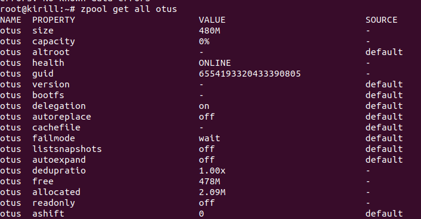

С помощью некоторых команд можно смотреть настройки пула.
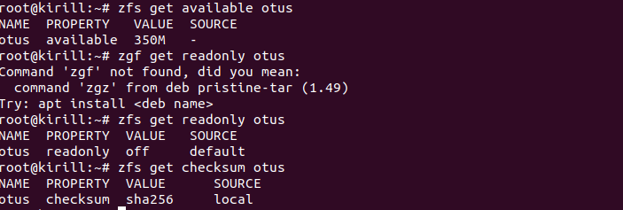

3. Работа со снапшотом, поиск сообщения от преподавателя.

Скачиваем файл-снапшот. Затем снапшот накатываем на dataset test пула otus, тем самым в пуле получили файлы снапшота.
Находим файл и смотрим "сообщение от преподавателя": https://otus.ru/lessons/linux-hl/
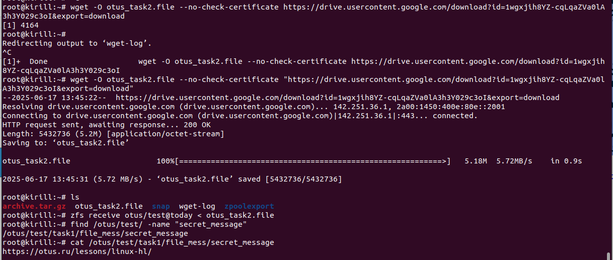
